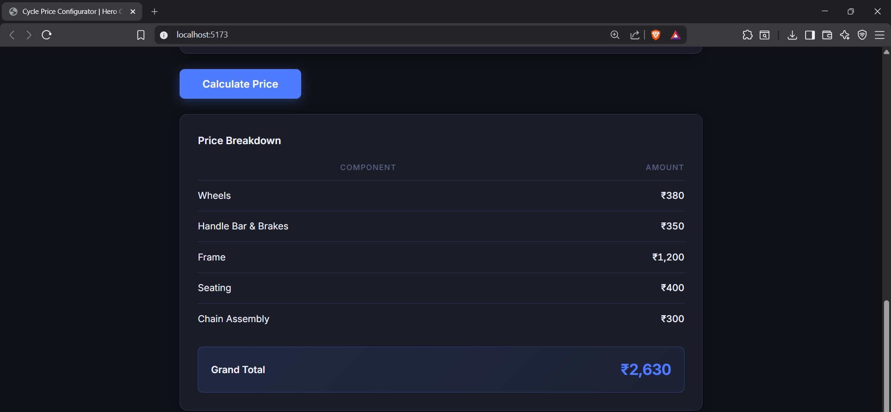
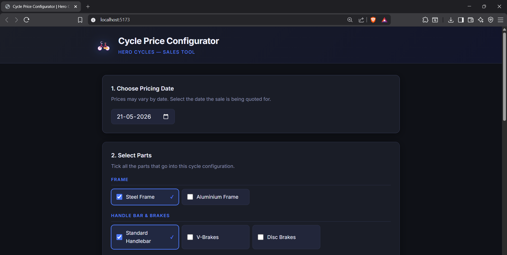

# Cycle Pricing Engine — Hero Cycles

A full-stack web tool that lets a Hero Cycles salesperson select bicycle parts, pick a pricing date, and instantly see the total cost broken down by component. Prices are time-sensitive — the same part costs differently depending on the selected date.

---

## Tech Stack

| Layer    | Technology                            |
| -------- | ------------------------------------- |
| Frontend | React 18 + Vite                       |
| Backend  | Node.js + Express                     |
| Data     | Static JS file (no database required) |
| Tests    | Jest                                  |

---

## Folder Structure

```
cycle-pricing-engine/
├── README.md
├── THINKING.md
├── UI_NOTES.md
├── backend/
│   ├── package.json
│   ├── server.js               ← Express app entry point
│   ├── data/
│   │   └── parts.js            ← All part data with price history
│   ├── routes/
│   │   └── pricingRoutes.js    ← GET /api/parts, POST /api/calculate-price
│   ├── services/
│   │   └── pricingService.js   ← Core pricing logic (testable, no Express)
│   └── tests/
│       └── pricingService.test.js
└── frontend/
    ├── package.json
    ├── vite.config.js
    ├── index.html
    └── src/
        ├── main.jsx
        ├── App.jsx             ← Root component, owns all state
        ├── api.js              ← All fetch calls in one place
        ├── components/
        │   ├── PartSelector.jsx
        │   └── PriceBreakdown.jsx
        └── styles.css
```

---

## How to Run

### 1. Backend

```bash
cd backend
npm install
npm start
# Server runs on http://localhost:5000
```

For auto-reload during development:

```bash
npm run dev
```

### 2. Frontend

Open a **new terminal**:

```bash
cd frontend
npm install
npm run dev
# App opens at http://localhost:5173
```

> The Vite dev server proxies `/api` calls to `localhost:5000`, so both servers must be running.

### 3. Tests

```bash
cd backend
npm test
```

---

## API Reference

### GET `/api/parts`

Returns all parts grouped by component.

**Response:**

```json
{
  "Frame": [
    { "id": "steel_frame", "name": "Steel Frame", "component": "Frame" }
  ],
  "Wheels": [
    { "id": "tubeless_tyre", "name": "Tubeless Tyre", "component": "Wheels" }
  ]
}
```

---

### POST `/api/calculate-price`

**Request body:**

```json
{
  "date": "2016-12-15",
  "parts": [
    "steel_frame",
    "standard_handlebar",
    "v_brakes",
    "basic_saddle",
    "tubeless_tyre",
    "standard_rim",
    "tube",
    "spokes",
    "4_gear_assembly"
  ]
}
```

**Response:**

```json
{
  "breakdown": {
    "Frame": 1200,
    "Handle Bar & Brakes": 850,
    "Seating": 400,
    "Wheels": 1180,
    "Chain Assembly": 950
  },
  "total": 4580
}
```

**Error response (400):**

```json
{ "error": "No price found for part \"tubeless_tyre\" on date \"2010-01-01\"." }
```

---

## Screenshots

### Price Breakdown



### Cycle Configurator UI



## Pricing Logic

Each part has a `priceHistory` array. Every entry has:

- `validFrom` — the date the price started
- `validUntil` — the date it ended (`null` = still active)
- `price` — the price in rupees

When a date is submitted, the engine loops through each selected part's price history and picks the entry whose `[validFrom, validUntil]` range contains the given date. Component subtotals are summed, then added for the grand total.

**Example:** `tubeless_tyre` costs ₹450 before 2016-12-01 and ₹520 from 2016-12-01 onwards.
